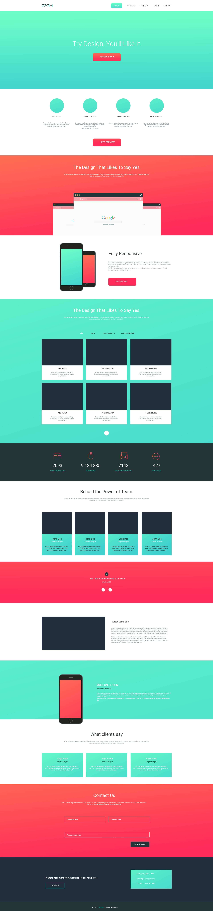
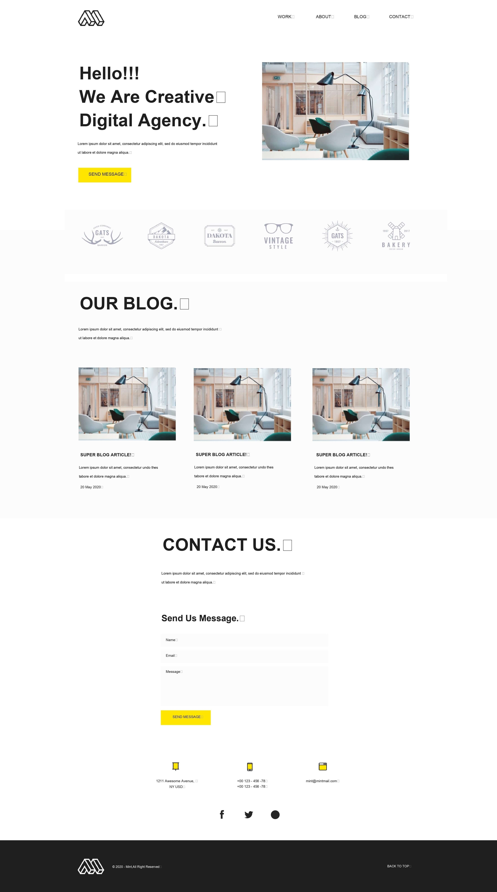

# Front End Basic 14.12.2021

## Lesson 9

#### [Flex.](https://julialuccio.github.io/Zhukovska-Front-End-Basic-14.12.2021/lesson9/) Деталі завдання

Зверстати макет через `flex` модель.

## Lesson 8

#### [Git. Github.](https://github.com/JuliaLuccio/Zhukovska-Front-End-Basic-14.12.2021) Деталі завдання

Створити репозиторій на `Github` та завантажити туди попередні роботи.

## Lesson 7

#### [Knowledge test. Video. Audio. Iframe.](https://julialuccio.github.io/Zhukovska-Front-End-Basic-14.12.2021/lesson7/) Деталі завдання

Зверстати сторінку згідно з макетом. У першій секції замість зображення вставити відео через `video` тег. У секції `Blog` замість 3-х зображень вставити відео з youtube через `iframe`.  
Підключити будь-який шрифт на власний розсуд. Використовувати семантичні теги. `Header` зробити `fixed`. Без адаптива та без flex-моделі.

## Lesson 6

#### [Pseudo elements ::before and ::after.](https://julialuccio.github.io/Zhukovska-Front-End-Basic-14.12.2021/lesson6/) Деталі завдання

Зробити меню, що випадає (без анімації) в 4 яруси і використовувати `::before` і `::after`

## Lesson 5

#### [Work with text using classes.](https://julialuccio.github.io/Zhukovska-Front-End-Basic-14.12.2021/lesson5/work-with-text/) Деталі завдання

Прикріплений psd макет. Потрібно зверстати згідно до макету. Верстаємо, використовуючи класи.  

Властивості з якими доведеться зіткнутися:

`font-family`, `font-size`, `line-height`, `font-weight`, `margin`, `background`, `text-shadow`, `text-decoration`,`color`, `max-width (width)`

#### [Positioning CSS. Border.](https://julialuccio.github.io/Zhukovska-Front-End-Basic-14.12.2021/lesson5/position-and-border/) Деталі завдання

Зробити верстку за малюнком, використовуючи `position` і `border`

## Lesson 4

#### [CSS. Float. Margin. Padding. Calc.](https://julialuccio.github.io/Zhukovska-Front-End-Basic-14.12.2021/lesson4/float/) Деталі завдання

Зверстати за малюнком, використовуючи `margin`, `padding`, `float` та `calc`.

#### [CSS. Float.](https://julialuccio.github.io/Zhukovska-Front-End-Basic-14.12.2021/lesson4/pig/) Деталі завдання

Зверстати за малюнком, використовуючи `margin`, `padding` та `float`.

## Lesson 3

#### [Practice with text.](https://julialuccio.github.io/Zhukovska-Front-End-Basic-14.12.2021/lesson3/work_with_text/) Деталі завдання

Використовуючи заголовки `h1-h6`, `span`, `a` (посилання) і абзаци `p`, розмітити текст, що додається.

Створити зовнішній вигляд тексту за допомогою стилів.

#### [The Forms.](https://julialuccio.github.io/Zhukovska-Front-End-Basic-14.12.2021/lesson3/forms/) Деталі завдання

Уявімо, що ви працюєте над сайтом з продажу та пошуку автомобілів. Користувач може зайти на ваш сайт, зареєструватися та почати шукати собі машину. Для того, щоб такий сайт реалізувати, потрібно зробити щонайменше три форми: `Реєстрацію, Авторизацію, Пошук`.

> Реєстрація: Email, Пароль, Підтвердження пароля

> Авторизація (Вхід на сайт): Email, Пароль, Запам'ятати пароль

> Пошук:
* Тип кузова
* Марка авто
* Країна виробник
* Ціна (від і до)
* Рік випуску (від і до)
* Стан (Бита, У кредиті, Не розмитнена і т.д. Одночасно може бути кілька пунктів обрано)
* Тип палива
* Тип коробки
* Колір
* Комфорт (Люк, Шкіряний салон тощо)

Доповнювати все це ви можете на свій розсуд, а також підглядаючи на аналогічних сайтах. Можете проявити свою фантазію, адже по суті кожне таке поле можна реалізувати абсолютно по-різному.

## Lesson 2

#### [Absolute-and-relative-paths.](https://julialuccio.github.io/Zhukovska-Front-End-Basic-14.12.2021/lesson2/absolute-and-relative-paths) Деталі завдання

Ви маєте створити сайт.

* Структура тек. У вас має бути 2 теки:

`pages` - тут лежатимуть ваші сторінки та `images` - тут лежатимуть ваші зображення

* У вас має бути щонайменше 4 сторінки. На кожній сторінці має бути меню. В якому будуть посилання. Ці посилання повинні пов'язувати усі сторінки між собою. Натиснувши на перше посилання в цьому меню, ви потрапите на першу сторінку. Натиснувши на другу – на другу сторінку. І т.д.

* Зміст. На цих сторінках ви можете розмістити будь-яку інформацію. Важливо, щоб на цих сторінках були обов'язково зображення (які ви покладете в папку images). Також важливо використовувати ті теги з якими ми познайомилися.

Можна робити лаконічно. Якщо складно вигадати про що буде ваш сайт, зробіть його про котиків. А три різні сторінки будуть з описом трьох різних порід котиків). Дотримуйтесь форматування.

#### [Colored Square.](https://julialuccio.github.io/Zhukovska-Front-End-Basic-14.12.2021/lesson2/colored-square) Деталі завдання

Потрібно повторити малюнок за допомогою таблиці.

#### [Periodic table.](https://julialuccio.github.io/Zhukovska-Front-End-Basic-14.12.2021/lesson2/mendeleev-table/) Деталі завдання

Потрібно повторити малюнок за допомогою таблиці. Щось можна трохи спростити, але намагатись зробити максимально схоже.

Порожніх рядків `tr` у таблиці залишатися не повинно)

Не намагайтеся повторити пропорції ідеально. Важливо зробити таку ж кількість комірок, з таким самим поділом. Але якщо у вас достатньо часу, то можете його витратити, щоб довести до досконалості це)

## Lesson 1

#### [Introduction. HTML.](https://julialuccio.github.io/Zhukovska-Front-End-Basic-14.12.2021/lesson1/) Деталі завдання

Потрібно зробити сторінку про себе (про свою улюблену команду, виконавця тощо).
На цій сторінці має бути фотографія, коротка інформація на кшталт тієї, яка зазвичай вказується в резюме (автобіографії).

Додати посилання на інші сайти (наприклад на ваші соц. мережі) і зробити так, щоб ці посилання відкривалися в новому вікні.

Використовувати необхідно теги, які використовували на занятті).

